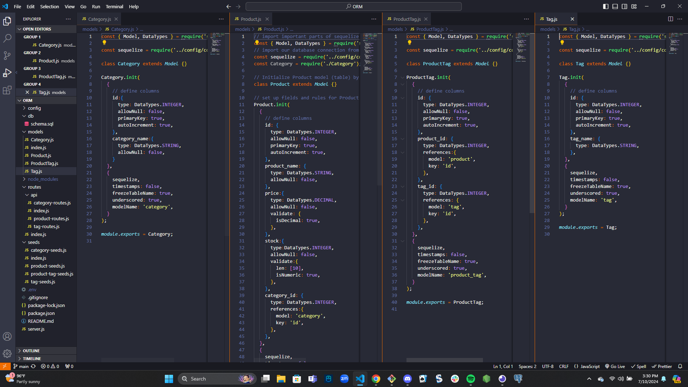
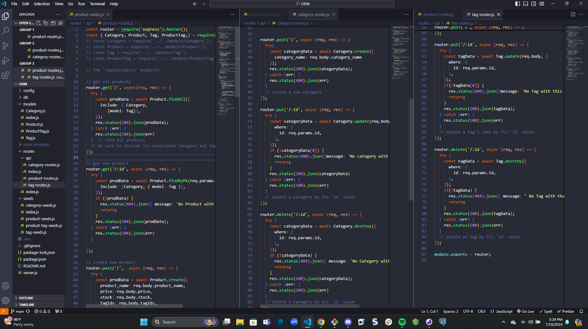

# ORM
## GitHub
thomassmith0526
## Table of Contents
* [Email](#Email)
* [Description](#Description)
* [License](#License)
* [Video-Link](#Video-Link)
* [Screen-Shots](#Screen-Shots)
* [Render](#Render)
## Email
thomassmith0526@gamil.com
## Description
took the started code that was given to us and made 4 different models and 3 different routes js files i was able to link them all together so i can run the seeds folder so i can get all the info in to the database created in SQL called ecommerce_db username is postgres and pw is texas.
## License
N/A
## Video Link 
https://www.youtube.com/watch?v=p_5shH64wYg
## Screen Shots

## Render Link

## Question 
If you have any questions please fill free to email me at thomassmith0526@gmail.com